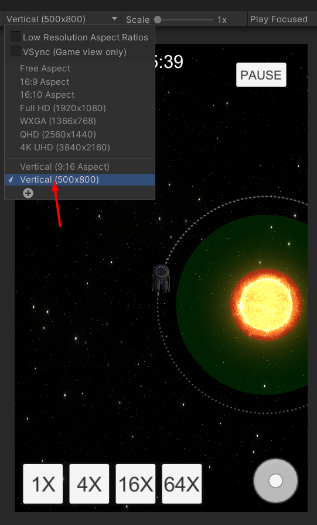
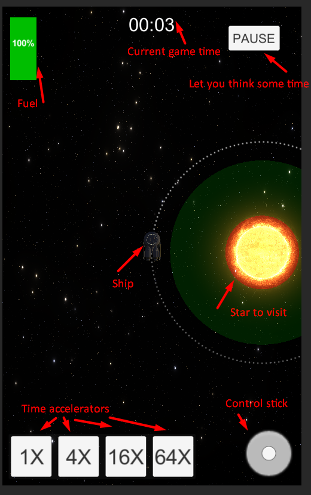

## SpaceTraveler
This is a 2D game about traveling between stars with gravity impacts. Controlling spaceship you need to fit certain conditions to pass level with all stars.

Star background and big stars are fully procedural with shaders and it was main headache in this project.

Start with scene Main. At least 2 levels currently are workable.

Also there are several test scenes StarTestScene, StarBackgroundTest which are using for test scenarios, they can have errors for now or in future.

Game works in resolution 500x800 (vertical mode), so if from start it doesn't have such resolution plaese add it for correct work before play.

There is a stick to control ship, just click right mouse button anywhere on the screen and drag it. Also you can zoom in and out with mouse scroll. To accelerate time use buttons 1X, 4X, 16X, 64X

